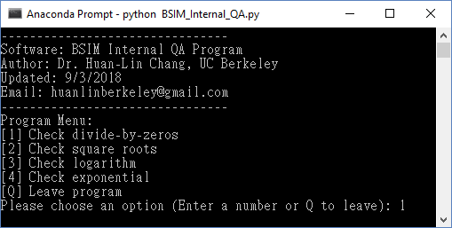
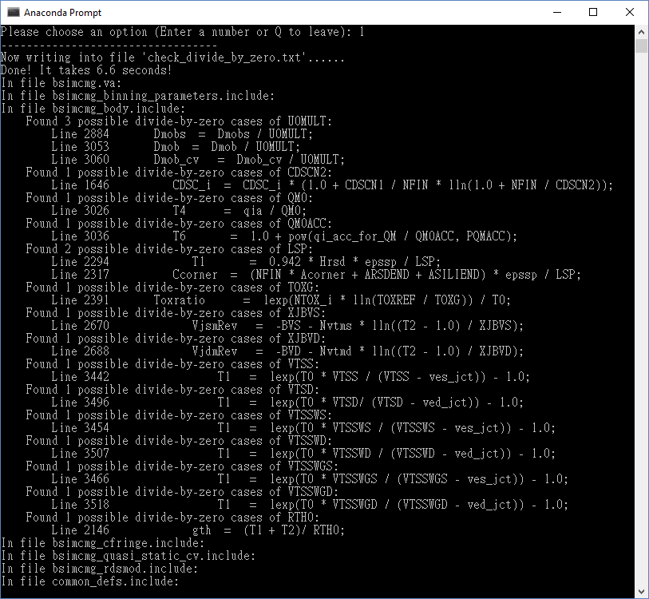

# BSIM Internal QA Program
The program is written in `Python 3.6`. No extra libraries are needed.

### How to use
First, put your code under folder `code`. Here, we use BSIM-CMG code as an example.

Second, execute the program in BWRC server by
```python
python3.6 BSIM_Internal_QA.py
```

> In other servers, `python3.6` might be `python3` or `python`. Make sure your server supports Python 3.6. You can check the version by entering `python3 --version` or `python --version`.

Then you will see a menu like the following, enter your options or enter Q to leave.



Here we enter `1` to check divide-by-zero cases. In several seconds, you will see the following results. These results are also saved into a file named `check_divide_by_zero.txt` for you to check later. The program finds all parameters in `MPRnb`, `IPRnb`, `MPRcz`, and `IPRcz` parameter range (which allows parameter to be 0) that appears in the denominators. The program reduces thousands of lines's work down to tens of lines by humans, where human discretion kicks in to see whether it is a false alarm or not.

For example, the program shows that in file `bsimcmg_body.include`, there are 3 possible cases (Ln. 2884, 3053, and 3060) of `U0MULT` in the denominators. Since `U0MULT` is allowed to be 0 set by users, there will be divide-by-zero errors if users do so. 


